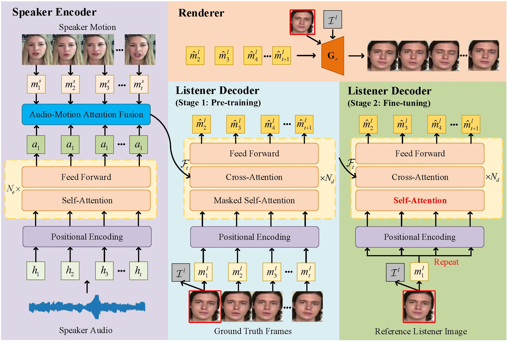

# ListenFormer.github.io
<html>
<head>
  <meta charset="utf-8">
  <meta name="description"
        content="">
  <meta name="keywords" content="Speech-driven, 3D facial animation, codebook, discrete motion prior">
  <meta name="viewport" content="width=device-width, initial-scale=1">
  <title>ListenFormer</title>

  <!-- Global site tag (gtag.js) - Google Analytics -->
  <!--  -->
  

  <link href="https://fonts.googleapis.com/css?family=Google+Sans|Noto+Sans|Castoro"
        rel="stylesheet">

  <link rel="stylesheet" href="./static/css/bulma.min.css">
  <link rel="stylesheet" href="./static/css/bulma-carousel.min.css">
  <link rel="stylesheet" href="./static/css/bulma-slider.min.css">
  <link rel="stylesheet" href="./static/css/fontawesome.all.min.css">
  <link rel="stylesheet"
        href="https://cdn.jsdelivr.net/gh/jpswalsh/academicons@1/css/academicons.min.css">
  <link rel="stylesheet" href="./static/css/index.css">
  <link rel="icon" href="./static/images/favicon.svg">

  
  
  
  
  
</head>
<body>

  <section class="hero">
    

      

        

          

            

              <!-- Paper authors -->
              
              <a target="_blank">Miao Liu</a>,
              
              <a target="_blank">Jing Wang</a>,
              
              <a target="_blank">Xinyuan Qian</a>,
              
              <a target="_blank">Haizhou Li</a>
            

            
              <a href="https://github.com/liushenme/ListenFormer" target="_blank" class="external-link button is-normal is-rounded is-dark">
                
                  <i class="fab fa-github"></i>
                
                Code
              </a>
            
            <!-- </a>
             -->
          

        

      

    

  </section>

<section class="section">
  

    <!-- Abstract. -->
    

      

        <h2 class="title is-3">Abstract</h2>
        

          

As one of the crucial elements in human-robot interaction, responsive listening head generation has attracted considerable attention from researchers. It aims to generate a listening head video based on a speaker audio and video as well as a reference listener image. However, existing methods exhibit two limitations: 1) their generation capability is limited, resulting in generated videos that are far from real ones in terms of emotional expression and diversity, and 2) they mostly employ non-autoregressive generation methods, unable to mitigate the risk of error accumulation. To tackle these issues, we propose Listenformer that leverages the powerful temporal modeling capability of transformers for generation, and can perform non-autoregressive prediction with the proposed two-stage training method. To fully utilize the information from the speaker inputs, we designed an audio-motion attention fusion module, which improves the correlation of audio-motion features for accurate response. Additionally, a novel decoding method is proposed for Listenformer, demonstrating both excellent computational efficiency and effectiveness. Extensive experiments demonstrate that Listenformer outperforms the existing state-of-the-art methods on ViCo and L2L datasets. And a perceptual user study shows the comprehensive performance of our method in generating diversity, identity preserving, speaker-listener synchronization, and attitude matching.
          

        

      

    

    <!--/ Abstract. -->
  

</section>

<section class="section">
  

<!-- Method. -->
    

      

        <h2 class="title is-3">Method</h2>
        

          

            ListenFormer can generate a listening head video based on a speaker audio and video as well as a reference listener image.
          

        

         

        

          
        

      

    

  

</section>  
<!--/ Method. -->
<section class="section">
  

    

      

        <h2 class="title is-3">Comparison</h2>

       
	  

        <h2>ViCo</h2>
        <video width="224" height="112" controls>
            <source src="show/Qualitative Evaluation (Figure 5_1)/1_ViCo.mp4" type="video/mp4">
            Your browser does not support the video tag.
        </video>
      

      

          <h2>PCHG</h2>
          <video width="224" height="112" controls>
              <source src="show/Qualitative Evaluation (Figure 5_1)/2_PCHG.mp4" type="video/mp4">   
              Your browser does not support the video tag.
          </video>
      

      

          <h2>DSPN</h2>
          <video width="224" height="112" controls>
              <source src="show/Qualitative Evaluation (Figure 5_1)/3_DSPN.mp4" type="video/mp4">   
              Your browser does not support the video tag.
          </video>
      

       

          <h2>Ours</h2>
          <video width="224" height="112" controls>
              <source src="show/Qualitative Evaluation (Figure 5_1)/4_Ours.mp4" type="video/mp4">   
              Your browser does not support the video tag.
          </video>
      
      
        
	

        <video width="224" height="112" controls>
            <source src="show/Qualitative Evaluation (Figure 5_2)/1_ViCo.mp4" type="video/mp4">
            Your browser does not support the video tag.
        </video>
      

      

          <video width="224" height="112" controls>
              <source src="show/Qualitative Evaluation (Figure 5_2)/2_PCHG.mp4" type="video/mp4">   
              Your browser does not support the video tag.
          </video>
      

      

          <video width="224" height="112" controls>
              <source src="show/Qualitative Evaluation (Figure 5_2)/3_DSPN.mp4" type="video/mp4">   
              Your browser does not support the video tag.
          </video>
      
        
      

          <video width="224" height="112" controls>
              <source src="show/Qualitative Evaluation (Figure 5_2)/4_Ours.mp4" type="video/mp4">   
              Your browser does not support the video tag.
          </video>
      

        
	  

        <video width="224" height="112" controls>
            <source src="show/Qualitative Evaluation (negative attitude)/1_ViCo.mp4" type="video/mp4">
            Your browser does not support the video tag.
        </video>
      

      

          <video width="224" height="112" controls>
              <source src="show/Qualitative Evaluation (negative attitude)/2_PCHG.mp4" type="video/mp4">   
              Your browser does not support the video tag.
          </video>
      

      

          <video width="224" height="112" controls>
              <source src="show/Qualitative Evaluation (negative attitude)/3_DSPN.mp4" type="video/mp4">   
              Your browser does not support the video tag.
          </video>
      
        
      

          <video width="224" height="112" controls>
              <source src="show/Qualitative Evaluation (negative attitude)/4_Ours.mp4" type="video/mp4">   
              Your browser does not support the video tag.
          </video>
      

      

    

  

</section>  
